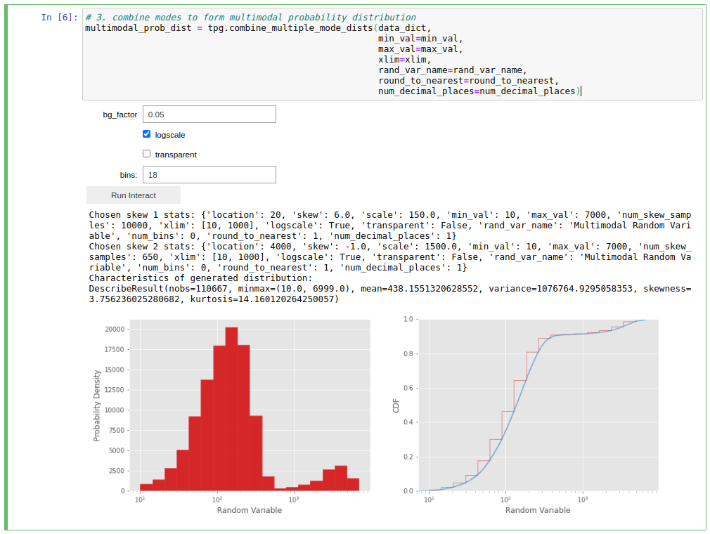

Node Distributions
^^^^^^^^^^^^^^^^^^
Network traffic travels from a **source** node to a **destination** node.
Source-destination nodes are **endpoints** in a network

.. nbplot::

    >>> endpoints = ['server_'+str(i) for i in range(5)]

How regularly each node is selected as a source or destination is determined by a
**node distribution probability matrix**. The most simple node distribution
is the **uniform distribution**

.. nbplot::
    
    >>> node_dist, fig = tpg.gen_uniform_node_dist(eps=endpoints,show_fig=True) 

Since different endpoint nodes in a network likely have different hardware
capabilities, network node distributions are rarely uniform. Instead, some nodes
become 'hot nodes' and are requested more than others, forming a **multimodal
node distribution**

.. nbplot::

    >>> node_dist, fig = tpg.gen_multimodal_node_dist(eps=endpoints,skewed_nodes=['server_2'],show_fig=True)

Instead of certain *nodes* being requested more regularly, sometimes certain
*node pairs* in the network might be skewed, forming a **multimodal node pair**
distribution

.. nbplot::

    >>> node_dist, fig = tpg.gen_multimodal_node_pair_dist(eps=endpoints,skewed_pairs=[['server_1','server_3'],['server_4','server_2']], show_fig=True)

Different networks have different node distributions. Sometimes you may want a 
simple uniform distribution, or a slightly skewed distribution, or certain nodes 
being heavily in demand, or certain node pairs being heavily in demand. Furthermore,
you may want all of the above, but may also want to specify certain things yourself
(e.g. which specific nodes/pairs to bias, how high demand they're in, how many nodes
are in high demand etc.), or you may want these specifics to be randomly generated.
The above functions handle all of the above functionality. See their documentation
for further details.

You can create any size of node distribution you like to fit any network

.. nbplot::

    >>> endpoints = ['server_'+str(i) for i in range(64)]
    >>> node_dist, fig = tpg.gen_multimodal_node_pair_dist(eps=endpoints,show_fig=True)

Once you have your node probability distribution, you can use it to generate 
as many source-destination node pairs as you like

.. nbplot::

    >>> sn, dn = tpg.gen_node_demands(eps=endpoints,node_dist=node_dist,num_demands=1000)

Networks
^^^^^^^^

By definition, a network is a collection of nodes (vertices) which together
form pairs of nodes connected by links (edges). Some or all of these nodes can 
act as **sources** and **destinations** for network traffic **demands**. Such 
network nodes are referred to as **endpoints**. Endpoints might be separated by 
multiple links and nodes, some of which may be endpoints and some not. 

Generate a simple 5-node network

.. nbplot::

    >>> network = tpg.gen_simple_network(ep_label='server', show_fig=True)

or the 14-node NSFNET network

.. nbplot::

    >>> network = tpg.gen_nsfnet_network(ep_label='server', show_fig=True)

or a fat-tree network

.. nbplot::

    >>> network = tpg.gen_fat_tree(k=4, show_fig=True)

A single demand in a network can be considered as either a **flow** or a computation
graph (a **job**) whose dependencies (edges) may form flows. Both flow-centric
and job-centric network traffic demand generation and management are supported
by TrafPy.

Flow-Centric Traffic Demands
^^^^^^^^^^^^^^^^^^^^^^^^^^^^
A flow is some information being sent from a source node to a destination node
in a network (e.g. a data centre network).

Common flow demand characteristics include:

- size;
- interarrival time; and
- source-destination node distribution.

Using the value and node distribution generation functions you've seen so far,
you can use TrafPy to generate realistic flow demands. Later in this tutorial,
you will see how to use TrafPy's Jupyter Notebook tool to visually shape your
distributions such that they match real data/literature distributions. For now,
assume that you already know the distribution parameters you want. Consider
that you want to create 1,000 realistic data centre flows in a simple 5-node
network

.. nbplot::

    >>> num_demands = 1000
    >>> network = tpg.gen_simple_network(ep_label='endpoint', show_fig=True)

You could start by defining the flow size distribution

.. nbplot::

    >>> flow_size_dist, _ = tpg.gen_named_val_dist(dist='weibull',params={'_alpha': 1.4, '_lambda': 7000},show_fig=True,rand_var_name='Flow Size',logscale=True,round_to_nearest=1,xlim=[1e2,1e12])

then the flow interarrival time distribution

.. nbplot::

    >>> interarrival_time_dist, _ = tpg.gen_named_val_dist(dist='lognormal',params={'_mu': 7.4, '_sigma': 2},show_fig=True,rand_var_name='Interarrival Time',logscale=True,round_to_nearest=1,xlim=[1e1,1e6])

and then the source-destination node distribution

.. nbplot::
    
    >>> endpoints = network.graph['endpoints']
    >>> node_dist = tpg.gen_multimodal_node_dist(eps=endpoints,num_skewed_nodes=1,show_fig=True)

You can then use your distributions to generate flow-centric demand data formatted
neatly into a single dictionary

.. nbplot::

    >>> flow_centric_demand_data = tpg.create_demand_data(num_demands=num_demands,eps=endpoints,node_dist=node_dist,flow_size_dist=flow_size_dist,interarrival_time_dist=interarrival_time_dist)

Don't forget to save your data as a pickle::

    tpg.pickle_data(data=flow_centric_demand_data,path_to_save='data/flow_centric_demand_data.pickle',overwrite=True,zip_data=True)

or as a csv::

    tpg.save_data_as_csv(data=flow_centric_demand_data,path_to_save='data/flow_centric_demand_data.csv',overwrite=True)

N.B. You can also re-load previously pickled data::
    
    >>> flow_centric_demand_data = tpg.unpickle_data(path_to_load='data/flow_centric_demand_data.pickle',zip_data=True)

TrafPy flow-centric demand data dictionaries are organised as::

    {
        'flow_id': ['flow_0', ..., 'flow_n'],
        'sn': [flow_0_sn, ..., flow_n_sn],
        'dn': [flow_0_dn, ..., flow_n_dn],
        'flow_size': [flow_0_size, ..., flow_n_size],
        'event_time': [event_time_flow_0, ..., event_time_flow_n],
        'establish': [event_establish_flow_0, ..., event_establish_flow_1],
        'index': [index_flow_0, ..., index_flow_1]
    }

Where ``'establish'`` keys' values are binary values indicating whether the demand is a connection
establishment request (1) or a take-down request (0) for a given event. Specifying 
take-down requests is optional in TrafPy. If take-downs have been speified, then
there will be ``2 * num_demands`` events in the demand data dictionary, otherwise
there will be ``num_demands`` events.

Job-Centric Traffic Demands
^^^^^^^^^^^^^^^^^^^^^^^^^^^
A job is a task sent to a network (such as a data centre) to execute. Jobs are 
computation graphs made up of **operations** (ops). Jobs might be e.g. a Google
search query, generating a user's Facebook feed, performing a TensorFlow machine
learning task (e.g. backpropagation), etc.

In this context, an op is a data process ran on some machine where the result
is specified by a pre-determined rule/programme. Each op requires >= 0 tensors/data 
objects as input, and produces >= tensors as output.

In a job computation graph, if an op v requires >= 1 input(s) produced by op u,
the ops will be connected by a directed edge, [u, v], representing the **dependency**
between the two ops. The edge attributes here are features of the tensor (e.g. 
size, source machine, destination machine, etc.).

In a data centre, when a job arrives, each op in the job is placed onto some
machine to execute the op. These ops might be placed all on one machine or, as
is often the case for many applications, spread out across different machines in the network
according to e.g. some heuristic. The **network** is used to pass the tensors around
between the machines executing the ops. These tensors/data objects flowing
between ops are **flows**. The flows of a given job might flow through the network
at the same time or at different times depending on e.g. scheduling decisions, constraints,
dependencies, etc.

.. note:: In a job graph, edges between ops represent 1 of 2 types of op dependency:

          - **Data dependency**: Op j can only begin when op i's output tensor(s)
            have arrived. Therefore, data dependencies become network flows *if*
            op j and op i are ran on separate network endpoints.
          - **Control dependency**: Op j can only begin when op i has finished.
            No data is exchanged, therefore control dependencies never become 
            network flows.

Common job demand characteristics include:

- job interarrival time;
- which machine each op in the job is placed on;
- number of ops in the job;
- run times of the ops;
- size of data dependencies (flows) between ops;
- ratio of control to data dependencies in job computation graph; and
- connectivity of job graph.

You can use the same value and node distributions as before to generate realistic
job demands. The only difference is that now you will pass additional arguments
into :func:`tpg.create_demand_data`. TrafPy will respond by generating job computation graphs
rather than flows as the demands in the returned dictionary.

Consider that you want to create 10 realistic data centre jobs in the same simple 
5-node network as before (but now omitting ``show_fig`` to save page space).

.. nbplot:: 

    >>> num_demands = 10
    >>> tpg.gen_simple_network(ep_label='endpoint')

You could start by definiing the flow size distribution of the flows inside the 
job graphs

.. nbplot::

    >>> flow_size_dist = tpg.gen_multimodal_val_dist(min_val=1,max_val=100,locations=[50],skews=[0],scales=[10],num_skew_samples=[10000],bg_factor=0,round_to_nearest=1,num_bins=34)

then the job interarrival time distribution

.. nbplot::

    >>> interarrival_time_dist = tpg.gen_multimodal_val_dist(min_val=1,max_val=1e8,locations=[1,1,3000,1,1800000,10000000],skews=[0,100,-10,10,50,6],scales=[0.1,62,2000,7500,3500000,20000000],num_skew_samples=[800,1000,2000,4000,4000,3000],bg_factor=0.025,round_to_nearest=1)

then the number of ops in each job

.. nbplot:: 

    >>> num_ops_dist = tpg.gen_multimodal_val_dist(min_val=50,max_val=200,locations=[100],skews=[0.05],scales=[50],num_skew_samples=[10000],bg_factor=0.05,round_to_nearest=1)

and then the source-destination node (i.e. op machine placement) distribution

.. nbplot::
    
    >>> endpoints = network.graph['endpoints']
    >>> node_dist = tpg.gen_multimodal_node_dist(eps=endpoints,num_skewed_nodes=1)

You can then use your distributions to generate your job-centric demand data
returned neatly into a single dictionary

.. nbplot::

    >>> job_centric_demand_data = tpg.create_demand_data(num_demands=num_demands,eps=endpoints,node_dist=node_dist,flow_size_dist=flow_size_dist,interarrival_time_dist=interarrival_time_dist,num_ops_dist=num_ops_dist,c=1.5,use_multiprocessing=False)

Don't forget to save your data::
    
    tpg.pickle_data(data=job_centric_demand_data,path_to_save='data/job_centric_demand_data.pickle',overwrite=True,zip_data=True)

TrafPy job-centric demand data dictionaries are organised as::

    {
        'job_id': ['job_0', ..., 'job_n'],
        'job': [networkx_graph_job_0, ..., networkx_graph_job_n],
        'event_time': [event_time_job_0, ..., event_time_job_n],
        'establish': [event_establish_job_0, ..., event_establish_job_1],
        'index': [index_job_0, ..., index_job_1]
    }

Where the ``'job'`` key contains the list of job computation graphs with all
the embedded demand data. You can visualise the job computation graph(s)::

    >>> jobs = list(job_centric_demand_data['job'][0:2])
    >>> fig = tpg.draw_job_graphs(job_graphs=jobs,show_fig=True) 

.. image:: images/job_graph_2.png
    :align: center

Additional Functionality
^^^^^^^^^^^^^^^^^^^^^^^^
Up to now, you have used TrafPy to create some number of demands. However,
it is often more useful to create an arbitrary number of demands such that a certain
**network load** is generated for an arbitrary network. Here, the **network capacity**
is the total *rate* at which information can be reliably transmitted over the network,
and the network load is the fraction of this capacity being requested during the
session. 

To specify the load and have the number of demands automatically generated,
the same functions you've seen above can be used, but now specifying the 
``network_load_config`` argument rather than ``num_demands``. E.g. to generate
demands that will request a 0.75 load of a network with a network capacity
of 6,000 Gbps:

# TEMPORARY COMMENT OUT OF BELOW CODE - BRING DEMO IN LATER WHEN FINALISED THIS FUNCTIONALITY
#.. nbplot::

#    >>> network_load_config = {'network_rate_capacity': 6000, 'target_load_fraction': 0.75}
#    >>> flow_centric_demand_data = tpg.create_demand_data(network_load_config=network_load_config,eps=endpoints,node_dist=node_dist,flow_size_dist=flow_size_dist,interarrival_time_dist=interarrival_time_dist)

Network endpoints/servers are often grouped into physically local clusters or 'racks'. 
Different networks may have different levels of inter- (between) and intra- (within) rack communication.
One way to specify this would be to set individual node pair probabilities with the ``gen_multimodal_node_pair_dist`` function
you've already seen, however this would be inconvenient and laborious. Instead, when using the above node distribution functions,
you can specify the ``rack_prob_config`` argument, which allows you to set the proportion of
traffic which should be inter-rack. TrafPy will then use your shaped node distribution
to create an adjusted node distribution which accounts for your specified rack probabilites.
For example, if you specify ``rack_prob_config`` in ``gen_uniform_node_dist``, you will not generate a perfectly
uniform node distribution as you would if you left ``rack_prob_config`` as ``None``,
but instead a node distribution with set inter- and intra-rack probabilities sampled
from a uniform distribution. You will need to specify which endpoints are
in which rack with a dictionary (this is automatically done for you if you
use one of the TrafPy networks). E.g. Making 20% of traffic inter-rack in a
fat-tree topology:

.. nbplot::

    >>> net = tpg.gen_fat_tree(k=3, N=2, num_channels=1)
    >>> fig = tpg.plot_network(net, draw_node_labels=True, network_node_size=1000)
    >>> print('Racks dict:\n{}'.format(net.graph['rack_to_ep_dict']))
    Racks dict:
    {'rack_0': ['server_0', 'server_1'], 'rack_1': ['server_2', 'server_3'], 
    'rack_2': ['server_4', 'server_5'], 'rack_3': ['server_6', 'server_7'], 
    'rack_4': ['server_8', 'server_9'], 'rack_5': ['server_10', 'server_11']}

    >>> rack_prob_config = {'racks_dict': net.graph['rack_to_ep_dict'], 'prob_inter_rack': 0.20}
    >>> node_dist, _ = tpg.gen_uniform_node_dist(net.graph['endpoints'], rack_prob_config=rack_prob_config, show_fig=True, print_data=False)

Making 90% of traffic inter-rack:

.. nbplot::

    >>> rack_prob_config = {'racks_dict': net.graph['rack_to_ep_dict'], 'prob_inter_rack': 0.90}
    >>> node_dist, _ = tpg.gen_uniform_node_dist(net.graph['endpoints'], rack_prob_config=rack_prob_config, show_fig=True, print_data=False)

Visually Shaping TrafPy Distributions
-------------------------------------
Up until now you have assumed you already knew all the parameters of each distribution
you have generated with TrafPy. But what if you want to replicate a distribution
which has either not been produced in TrafPy before or has not had open-access
data provided? TrafPy has a useful interactive Jupyter-Notebook which integrates with
all of the above functions, allowing distributions to be visually shaped. Crucially,
once a distribution has been shaped, it can be easily replicated with TrafPy so long
as the set of parameters used to shape the distribution are shared.

Academic papers present network traffic distribution information in many forms.
It could be e.g. a plot, an analyticaly described named distribution (e.g. 'the
connection duration times followed a log-normal distribution with mu -3.8 and
sigma 6.4'), an analytically described unnamed distribution (e.g. 'the flow
sizes followed a distribution with minimum 8, maximum 33,000, mean 6,450, skewness
1.23, and kurtosis 2.03') etc.

The TrafPy Jupyter Notebook tool enables distributions to be tuned visually
and analytically to reproduce literature distributions. Distribution plots are 
live-updated as slide bars, text boxes etc. are adjusted, with analytical characteristics
of the generated distributions continuously output to aid accuracy. 

Navigate to the directory where you cloned TrafPy and launch `the Jupyter Notebook <https://github.com/cwfparsonson/trafpy/blob/master/main.ipynb>`_::

    $ jupyter-notebook main.ipynb

The Notebook has a few main sections with markdown descriptions for each:

- Import ``trafpy.generator``
- Set global variables
- Generate random variables from 'named' distribution
- Generate random variables from arbitrary 'multimodal' distribution
- Generate discrete probability distribution from random variables
- Generate random variables from discrete probability distribution
- Generate source-destination node distribution
- Use node distribution to generate source-destination node demands
- Use previously generated distributions to create single 'demand data' dictionary
- Generate distributions in sets (extension)

All of the above sections can be used together or independently depending on which
functionalities you need to shape your specific distribution. Below are demonstrations
of how to use the interactive distribution-shaping cells.

.. note::
    To run a Jupyter Notebook cell, click on the cell and click 'Run' on the top ribbon.
    If you are running a cell with a TrafPy interactive graph, some configurable parameters
    will appear. Adjust these parameters and click the ``Run Interact`` button to update 
    your plot (and the returned values).

.. note::

    Once you have shaped your distribution, you can simply plug your shaped parameters
    into the previously described functions to generate your required random variable data/distributions
    in your own scripts. I.e. There is no need to have to save your Notebook data if you
    note down your shaped parameters and enter them into your own TrafPy scripts.

Set Global Variables
^^^^^^^^^^^^^^^^^^^^
Set the ``PATH`` global variable to the directory where you want any data generated with the Notebook
to be saved. You can also set the ``NUM_DEMANDS`` global variable, which will ensure
that each time you shape a distribution for a certain traffic demand characteristic,
the correct number of demands will be generated.

.. image:: images/set_global_variables.png
    :align: center
    

Generate Random Variables from 'Named' Distribution
^^^^^^^^^^^^^^^^^^^^^^^^^^^^^^^^^^^^^^^^^^^^^^^^^^^
Use this section to shape the previously described 'named' value distributions 
(Pareto, Weibull, etc.) generated by :func:`trafpy.gen_named_val_dist`.

Generate Random Variables from Arbitrary 'Multimodal' Distribution
^^^^^^^^^^^^^^^^^^^^^^^^^^^^^^^^^^^^^^^^^^^^^^^^^^^^^^^^^^^^^^^^^^
Use this section to shape the previously described 'multimodal' value distribution
generated by :func:`trafpy.gen_multimodal_val_dist`.

There are a few steps to generating a multimodal distribution with TrafPy:

1. Define the random variables of your multimodal distribution. Set the minimum 
   and maximum possible values, the number of modes, the name
   of your random variable, the x-axis limits, what to round the values to, and
   how many decimal places to include. Run the 1st cell.

.. image:: images/generate_random_variables_from_arbitrary_multimodal_distribution_1.png
    :align: center

2. Run the 2nd cell to launch the visualisation tool. A set of tuneable parameters
   for each mode (where you specified ``num_nodes`` in the previous cell)
   will appear. Adjust the parameters and click ``Run Interact`` until you are 
   happy with the shape of each mode. Use ``Location`` for the mode position, 
   ``Skew`` for the mode skew, ``Scale`` for the mode standard deviation, ``Samples``
   for the height of the mode's probability distribution, and ``bins`` for how many
   bins to plot (default of 0 automatically chooses number of bins).

   
.. image:: images/generate_random_variables_from_arbitrary_multimodal_distribution_2_2.png
    :align: center

3. Run the 3rd cell to combine the above modes. Adjust ``bg_factor`` to increase
   or decrease the 'background noise' amongst your shaped nodes.

.. note:: You may find it useful to jump between the 2nd and 3rd cells to improve the accuracy of the modes relative to one-another.

4. (Optional) Run the 4th cell to use your shaped multimodal distribution to sample
   random variable data.

5. (Optional) Run the 5th cell to save your mutlimodal random variable data

Generate Distributions in Sets
^^^^^^^^^^^^^^^^^^^^^^^^^^^^^^
.. note::
    This is an extension of the interactive toolbox primarily for TrafPy users
    who are not familiar with Python and want to simply run the Notebook to generate
    distribution and/or random variable data CSV files to import into their own
    e.g. MATLAB scripts. Users familiar with Python are encouraged to shape their
    distributions and then implement their own TrafPy scripts, and may therefore
    omit this final cell. 

The final cell in the TrafPy Jupyter Notebook tool allows users to generate
distributions without visualisation (i.e. the above cells are needed to first 
shape the distributions, or some prior shaping parameters are needed). This 
is useful for generating large amounts of data in 'sets', where some sets may
have different demand characteristics/distributions from others.

Simply configure the variables under ``# set vars`` (e.g. the number of sets 
``num_sets`` and the number of demands in each set ``num_demands``). Any
distributions to keep constant across all sets should be defined outside the for loop,
and those that should change should be defined within.

.. note::
    This is a basic script written for a specific use-case. Adjusting it to
    your specific needs may require some basic Python knowledge.

TrafPy Manager
--------------
.. note::
    The ``trafpy.manager`` package is still a working progress. The aim of it is
    to integrate easily with demand data generated by the ``trafpy.generator`` package to enable
    end-to-end network benchmarking, standardisation, learning-agent training etc. using only TrafPy.

As this tutorial has shown, TrafPy can be used as a stand-alone tool for generating, 
replicating, and reproducing network traffic data using the ``trafpy.generator``
package and the interactive Jupyter Notebook tool. TrafPy also comes with another
package, ``trafpy.manager``, which uses generated network traffic data to simulate
networks. ``trafpy.manager`` can be used as a tool for e.g. benchmarking and comparing
different network managers (routers, schedulers, machine placers, etc.) and for e.g.
a reinforcement learning training environment.

``trafpy.manager`` works by initialising a network environment (e.g. a data centre network)
which itself is initialised with a TrafPy demand object, a scheduling agent, a routing agent,
and a network object. TrafPy comes with pre-built versions of each of these, but
has been designed such that users can write their own e.g. scheduler and benchmark
it with ``trafpy.manager`` and with network demands generated with ``trafpy.generator``.

Import the ``trafpy.generator`` package and the requried objects from the
``trafpy.manager`` package::

    import trafpy.generator as tpg
    from trafpy.manager import Demand, RWA, SRPT, DCN
    from imports import config

Where the ``config.py`` file might be defined as

.. literalinclude:: imports/config.py

Load your previously saved TrafPy demand data dictionary (see the TrafPy Generator
section above)::

    demand_data = tpg.unpickle_data(path_to_load='data/flow_centric_demand_data.pickle',zip_data=True)

Initialise the ``trafpy.manager`` objects::

    network = tpg.gen_simple_network(ep_label=config.ENDPOINT_LABEL,num_channels=config.NUM_CHANNELS)
    demand = Demand(demand_data=demand_data)
    rwa = RWA(tpg.gen_channel_names(config.NUM_CHANNELS), config.NUM_K_PATHS)
    scheduler = SRPT(network, rwa, slot_size=config.SLOT_SIZE)
    env = DCN(network, demand, scheduler, slot_size=config.SLOT_SIZE, max_flows=config.MAX_FLOWS, max_time=config.MAX_TIME)

And run your simulation using the standard OpenAI Gym reinforcement learning
framework::

    for episode in range(config.NUM_EPISODES):
    print('\nEpisode {}/{}'.format(episode+1,config.NUM_EPISODES))
    observation = env.reset(config.LOAD_DEMANDS)
    while True:
        print('Time: {}'.format(env.curr_time))
        action = scheduler.get_action(observation)
        print('Action:\n{}'.format(action))
        observation, reward, done, info = env.step(action)
        if done:
            print('Episode finished.')
            break

When completed, you can print TrafPy's summary of the scheduling session::

    >>> env.get_scheduling_session_summary(print_summary=True)
    -=-=-=-=-=-=-= Scheduling Session Ended -=-=-=-=-=-=-=
    SUMMARY:
    ~* General Info *~
    Total session duration: 80000.0 time units
    Total number of generated demands (jobs or flows): 10
    Total info arrived: 56623.0 info units
    Load: 0.7672975615099775 info unit demands arrived per unit time (from first to last flow arriving)
    Total info transported: 56623.0 info units
    Throughput: 0.7077875 info units transported per unit time

    ~* Flow Info *~
    Total number generated flows (src!=dst,dependency_type=='data_dep'): 10
    Time first flow arrived: 0.0 time units
    Time last flow arrived: 73795.36028834846 time units
    Time first flow completed: 10000.0 time units
    Time last flow completed: 80000.0 time units
    Total number of demands that arrived and became flows: 10
    Total number of flows that were completed: 10
    Total number of dropped flows + flows in queues at end of session: 0
    Average FCT: 7669.998225473775 time units
    99th percentile FCT: 18035.645744379803 time units

