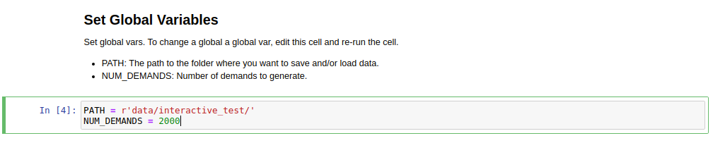
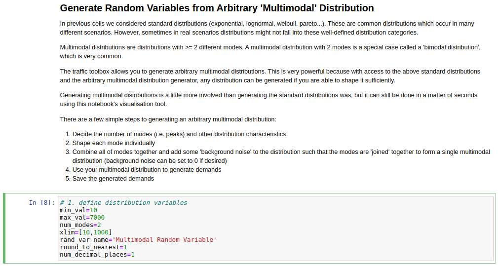
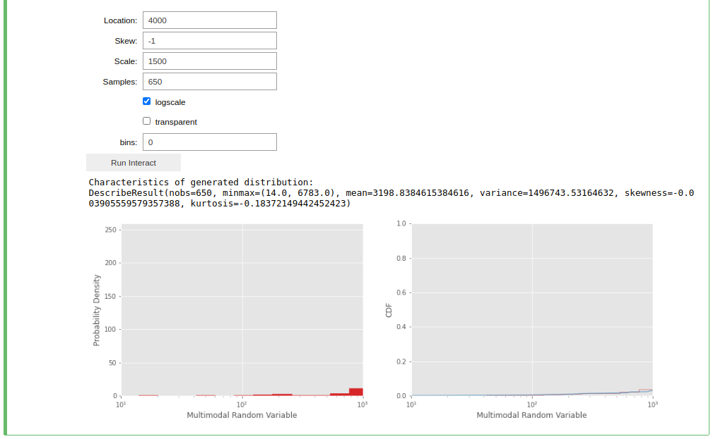

Visually Shaping TrafPy Distributions
=====================================
Up until now you have assumed you already knew all the parameters of each distribution
you have generated with TrafPy. But what if you want to replicate a distribution
which has either not been produced in TrafPy before or has not had open-access
data provided? TrafPy has a useful interactive Jupyter-Notebook which integrates with
all of the above functions, allowing distributions to be visually shaped. Crucially,
once a distribution has been shaped, it can be easily replicated with TrafPy so long
as the set of parameters used to shape the distribution are shared.

Academic papers present network traffic distribution information in many forms.
It could be e.g. a plot, an analyticaly described named distribution (e.g. 'the
connection duration times followed a log-normal distribution with mu -3.8 and
sigma 6.4'), an analytically described unnamed distribution (e.g. 'the flow
sizes followed a distribution with minimum 8, maximum 33,000, mean 6,450, skewness
1.23, and kurtosis 2.03') etc.

The TrafPy Jupyter Notebook tool enables distributions to be tuned visually
and analytically to reproduce literature distributions. Distribution plots are 
live-updated as slide bars, text boxes etc. are adjusted, with analytical characteristics
of the generated distributions continuously output to aid accuracy. 

Navigate to the directory where you cloned TrafPy and launch `the Jupyter Notebook <https://github.com/cwfparsonson/trafpy/blob/master/main.ipynb>`_::

    $ jupyter-notebook main.ipynb

The Notebook has a few main sections with markdown descriptions for each:

- Import ``trafpy.generator``
- Set global variables
- Generate random variables from 'named' distribution
- Generate random variables from arbitrary 'multimodal' distribution
- Generate discrete probability distribution from random variables
- Generate random variables from discrete probability distribution
- Generate source-destination node distribution
- Use node distribution to generate source-destination node demands
- Use previously generated distributions to create single 'demand data' dictionary
- Generate distributions in sets (extension)

All of the above sections can be used together or independently depending on which
functionalities you need to shape your specific distribution. Below are demonstrations
of how to use the interactive distribution-shaping cells.

.. note::
    To run a Jupyter Notebook cell, click on the cell and click 'Run' on the top ribbon.
    If you are running a cell with a TrafPy interactive graph, some configurable parameters
    will appear. Adjust these parameters and click the ``Run Interact`` button to update 
    your plot (and the returned values).

.. note::

    Once you have shaped your distribution, you can simply plug your shaped parameters
    into the previously described functions to generate your required random variable data/distributions
    in your own scripts. I.e. There is no need to have to save your Notebook data if you
    note down your shaped parameters and enter them into your own TrafPy scripts.

Set Global Variables
^^^^^^^^^^^^^^^^^^^^
Set the ``PATH`` global variable to the directory where you want any data generated with the Notebook
to be saved. You can also set the ``NUM_DEMANDS`` global variable, which will ensure
that each time you shape a distribution for a certain traffic demand characteristic,
the correct number of demands will be generated.

    

Generate Random Variables from 'Named' Distribution
^^^^^^^^^^^^^^^^^^^^^^^^^^^^^^^^^^^^^^^^^^^^^^^^^^^
Use this section to shape the previously described 'named' value distributions 
(Pareto, Weibull, etc.) generated by :func:`trafpy.gen_named_val_dist`.

.. image:: images/generate_random_variables_from_named_distribution.png
    :align: center

Generate Random Variables from Arbitrary 'Multimodal' Distribution
^^^^^^^^^^^^^^^^^^^^^^^^^^^^^^^^^^^^^^^^^^^^^^^^^^^^^^^^^^^^^^^^^^
Use this section to shape the previously described 'multimodal' value distribution
generated by :func:`trafpy.gen_multimodal_val_dist`.

There are a few steps to generating a multimodal distribution with TrafPy:

1. Define the random variables of your multimodal distribution. Set the minimum 
   and maximum possible values, the number of modes, the name
   of your random variable, the x-axis limits, what to round the values to, and
   how many decimal places to include. Run the 1st cell.

2. Run the 2nd cell to launch the visualisation tool. A set of tuneable parameters
   for each mode (where you specified ``num_nodes`` in the previous cell)
   will appear. Adjust the parameters and click ``Run Interact`` until you are 
   happy with the shape of each mode. Use ``Location`` for the mode position, 
   ``Skew`` for the mode skew, ``Scale`` for the mode standard deviation, ``Samples``
   for the height of the mode's probability distribution, and ``bins`` for how many
   bins to plot (default of 0 automatically chooses number of bins).

.. image:: images/generate_random_variables_from_arbitrary_multimodal_distribution_2_1.png
    :align: center
   

3. Run the 3rd cell to combine the above modes. Adjust ``bg_factor`` to increase
   or decrease the 'background noise' amongst your shaped nodes.

.. image:: images/generate_random_variables_from_arbitrary_multimodal_distribution_3.png
    :align: center

.. note:: You may find it useful to jump between the 2nd and 3rd cells to improve the accuracy of the modes relative to one-another.

4. (Optional) Run the 4th cell to use your shaped multimodal distribution to sample
   random variable data.

5. (Optional) Run the 5th cell to save your mutlimodal random variable data
